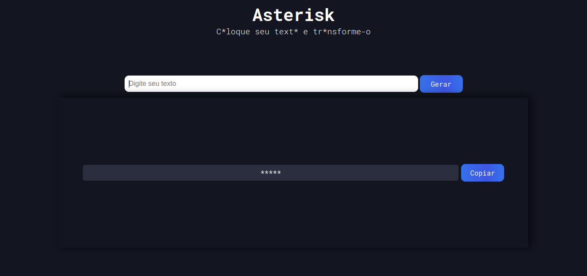
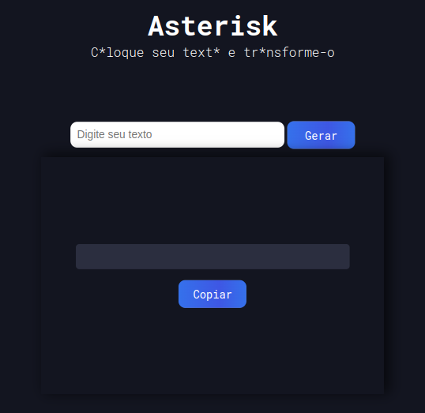
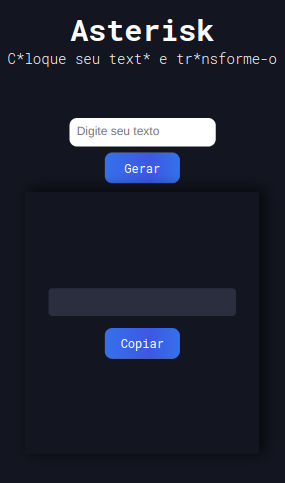

<h1 align="center">Asterisk</h1>

  

    
  

  

   
  
  

    
  

  

   
  
  

    
  

<h1 align="center">:sparkles: Tecnologias</h1>

Esse projeto foi desenvolvido com</h1>
 

<a href="https://www.javascript.com/">Javascript</a>

<a href="https://developer.mozilla.org/pt-BR/docs/Web/HTML">Html</a>

<a href="https://developer.mozilla.org/pt-BR/docs/Web/CSS">Css</a>

 

<h1 align="center">:computer: Sobre o Projeto</h1>

Asterisk, é um projeto para você colocar aquele texto que você quer tanto desabafar, mas não quer que as pessoas saibam, e também não está afim de censurar manualmente. Vá em frente, ele faz isso por vocẽ, coloque o seu texto e se exponha sem medo!

 

<h1 align="center">:rocket: Abrindo o Projeto</h1>
<pre align="center"><strong><a href="https://marlleyck.github.io/asterisk/">Clique aqui</a></strong></pre>

 

Feito! Utilize-o sem medo!

